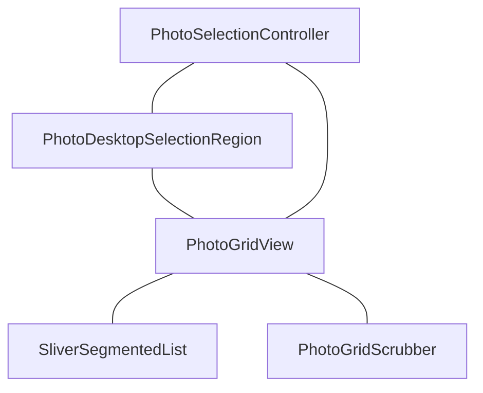

# immich_file_list

一个专为高性能相册体验设计的 Flutter 插件库。支持超大数据量（万级）的顺滑滚动、分级别逻辑吸附、多端自适应布局以及极致的 60FPS 渲染优化。

> [!IMPORTANT]
> **Desktop Pro 核心升级**：现已深度支持 **专业级桌面端交互**，通过几何算力实现像素级的框选、键盘连选与自动滚动。

---

## 🚀 核心特性

- **极致性能**：基于分段渲染（Segmented Rendering）与视口外缓存，轻松应对 100,000+ 照片数据的秒级加载与顺滑滚动。
- **专业级桌面方案 (PRO)**：
  - **全量圈选**：支持跨视口框选，即使项已滑出屏幕，选中状态依然精准保持。
  - **键鼠联动**：方向键导航配合主从模式，支持 Shift/Ctrl 修饰键，模拟原生 macOS Finder 体验。
  - **强力焦点管理**：内置 Focus 拦截系统，防止导航时焦点意外溢出到页面其他组件。
  - **自动跟随滚动**：拖拽至边界或键盘切换到视口外时，系统自动智能补正滚动位置。
- **解耦式架构**：核心展示（Grid）、手势交互（Region）、状态管理（Controller）高度解耦，支持自由插拔。
- **多端适配**：内置 `AdaptiveContainer` 配合双缓冲计算，解决桌面端拉伸窗口时的重复 Layout 抖动。

---

## 📂 项目架构



---

## 📦 核心组件 API

### 1. PhotoGridView (展示核心)
负责高性能网格渲染与时间轴逻辑。

| 属性名 | 类型 | 描述 |
| :--- | :--- | :--- |
| `items` | `List<PhotoGridItem>` | **必填**。需实现 `PhotoGridItem` 接口。 |
| `assetsPerRow` | `int` | 每行显示的列数，支持实时滑动调整。 |
| `margin` | `double` | 图片间距。 |
| `childAspectRatio` | `double` | 图片长宽比（正方形建议 1.0）。 |
| `groupBy` | `GroupPhotoBy` | 分组策略（按日/按月/无）。 |
| `topSliver` | `Widget?` | 顶部插入的自定义 Sliver 容器。 |
| `onLayoutInfoChanged` | `Function(Map)` | **关键**。将内部几何 Rects 同步给交互层。 |

### 2. PhotoDesktopSelectionRegion (桌面交互)
包装在 Grid 之上的交互层，拦截原始手势。

| 功能 | 描述 |
| :--- | :--- |
| **鼠标圈选** | 实现逻辑坐标系下的框选算法。 |
| **键盘导航** | `Focus` 驱动的方向键移动及焦点环展示。 |
| **修饰键** | 系统级 Shift (范围) / Ctrl(Cmd) (单选/反选) 逻辑。 |
| **长按支持** | 兼容触控设备的长按激活。 |

### 3. PhotoGridScrubber (侧边滑块)
独立的悬浮日期滑块，支持拖拽快速定位。

### 4. AdaptiveContainer (自适应布局)
处理桌面端窗口缩放，提供防抖（Debounce）后的稳定宽度回调。

---

## 🛠️ 快速集成

### 第一步：实现数据接口
```dart
class MyAsset implements PhotoGridItem {
  @override String get id => 'asset_id';
  @override DateTime get date => DateTime.now();
  
  @override
  Widget itemBuilder(BuildContext context, double size) {
    return Image.network(url, width: size, height: size, fit: BoxFit.cover);
  }
}
```

### 第二步：组合 UI
```dart
final selectionController = PhotoSelectionController();

@override
Widget build(BuildContext context) {
  return PhotoDesktopSelectionRegion(
    selectionController: selectionController,
    allItemIds: items.map((e) => e.id).toList(),
    child: PhotoGridView(
      items: items,
      selectionController: selectionController,
      onLayoutInfoChanged: (map) {
         // 可选：PhotoGridGallery 已内置此同步逻辑
      },
    ),
  );
}
```

---

## 💡 进阶优化建议

1. **几何算力优化**：在 Windows/macOS 端，默认开启 `onLayoutInfoChanged` 同步，这是实现滑出视口依然保持选中的核心。
2. **列表隔离**：将顶部导航（AppBar）与照片库隔离，确保网格重排时不会引起顶层不必要的 Build。
3. **状态管理**：建议全局共用一个 `PhotoSelectionController` 实例以支持跨页面的选择模式回传。

---

## 📖 演示案例
项目 `example/` 目录下涵盖 7+ 独立案例：
- **Desktop MacOS PRO** (`desktop_macos_page.dart`): 模拟 macOS 访达交互的最佳实践。
- **Dynamic Layout**: 演示实时调整列数、间距对性能的 0 损耗。

---

## 许可证
MIT License.
